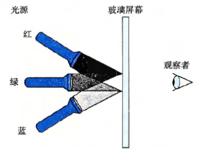

通过混合三种不同颜色的光（红色、绿色和蓝色），计算机可以在视频屏幕或者液晶显示器上产生彩色的画面。设想一种简单的方法，使用三种不同颜色的光，每种光都能打开或关闭，投射到玻璃屏幕上，如图所示：

那么基于光源R（红）、G（绿）、B（蓝）的关闭(0) 或打开(1)，就能够创建8种不同的颜色：

|R|G|B|颜色|
|---|---|---|---|
|0|0|0|黑色|
|0|0|1|蓝色|
|0|1|0|绿色|
|0|1|1|蓝绿色|
|1|0|0|红色|
|1|0|1|红紫色|
|1|1|0|黄色|
|1|1|1|白色|

这些颜色中的每一种都能用一个长度为3的位向量来表示，可以对它们进行布尔运算。
A. 一种颜色的补是通过关掉打开的光源，且打开关闭的光源而形成的。那么上面列出的8种颜色每一种的补是什么？

|颜色|位向量|位向量的补|补色|
|---|---|---|---|
|黑色|[000]|[111]|白色|
|蓝色|[001]|[110]|黄色|
|绿色|[010]|[101]|红紫色|
|蓝绿色|[011]|[100]|红色|
|红色|[100]|[011]|蓝绿色|
|红紫色|[101]|[010]|绿色|
|黄色|[110]|[001]|蓝色|
|白色|[111]|[000]|黑色|

B. 描述下列颜色应用布尔运算的结果：
- 黄色|绿色 = [110]|[010]=[110] = 黄色
- 黄色&蓝绿色 = [110]&[011]=[010] = 绿色
- 红色^红紫色 = [100]^[101]=[001] = 蓝色